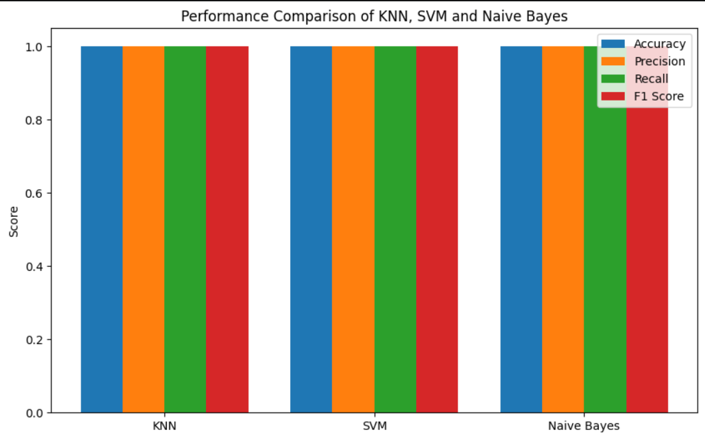

# 🧠 Spam Message Classification using Machine Learning

# 📌 Project Overview

This project implements and compares three popular machine learning classification algorithms for **Spam Message Detection**:

* 🔹 K-Nearest Neighbors (KNN)
* 🔹 Support Vector Machine (SVM)
* 🔹 Naive Bayes Classifier

The objective of this project is to classify messages into **Spam** and **Non-Spam** categories and evaluate the performance of each classifier using multiple evaluation metrics.

---

# 📂 Dataset Description

The dataset consists of various message characteristics such as:

* 📩 Message Length
* 🔣 Number of Special Characters
* 🌐 Number of URLs
* 🔑 Keyword Frequency Score
* 👤 Sender Activity Score
* ⏰ Time-Based Features
* 🎯 Target Variable: **Spam_Label**

---

# 🔗 Dataset Link

Replace this with your dataset URL:

- [Message_Intelligence_Dataset_5200.csv](Message_Intelligence_Dataset_5200.csv)

---

# ⚙️ Project Workflow

```text
Dataset Collection
        │
        ▼
Data Preprocessing
        │
        ▼
Feature Scaling
        │
        ▼
Train-Test Split
        │
        ▼
KNN Model
        │
        ▼
SVM Model
        │
        ▼
Naive Bayes Model
        │
        ▼
Performance Evaluation
        │
        ▼
Model Comparison
        │
        ▼
Final Analysis
```

---

# 🚀 Algorithms Used

## 1️⃣ K-Nearest Neighbors (KNN)

### Advantages

✔ Simple and easy to implement
✔ Effective for small datasets
✔ No explicit training phase

### Disadvantages

❌ Sensitive to noise
❌ Computationally expensive for large datasets
❌ Performance depends on K value

---

## 2️⃣ Support Vector Machine (SVM)

### Advantages

✔ High accuracy and precision
✔ Works well with high-dimensional data
✔ Effective for linear and non-linear classification

### Disadvantages

❌ More complex
❌ Requires parameter tuning
❌ Training can be time-consuming

---

## 3️⃣ Naive Bayes

### Advantages

✔ Fast and efficient
✔ Suitable for text classification
✔ Performs well on large datasets

### Disadvantages

❌ Assumes feature independence
❌ Less effective when features are highly correlated

---

# 📊 Evaluation Metrics

The following classification metrics were used:

* ✅ Accuracy
* ✅ Precision
* ✅ Recall
* ✅ F1 Score

---

# 📈 Visualizations

Several plots were created to analyze model performance:


* 📌 Bar plot
* 📌 Scatter Plot

## 📸 Screenshots

- 

---

# 🏆 Model Comparison

| Model       | Category       | Major Strength      |
| ----------- | -------------- | ------------------- |
| KNN         | Distance-Based | Easy Implementation |
| SVM         | Margin-Based   | Highest Accuracy    |
| Naive Bayes | Probabilistic  | Fast Execution      |

---

# 💡 Business Recommendation

### Support Vector Machine (SVM) is recommended for real-world deployment because:

* It provides higher classification accuracy.
* It minimizes false positives.
* It performs well on high-dimensional datasets.
* It offers better overall performance compared to KNN and Naive Bayes.

---

# 📁 Project Structure

```bash
Spam-Message-Classification/
│
├── PR-4.ipynb
├── README.md
├── Dataset.csv
├── requirements.txt
├── Images/
│
├── Outputs/
│
└── Plots/
```
---

# 🛠 Technologies Used

* Python 3.13
* NumPy
* Pandas
* Matplotlib
* Seaborn
* Scikit-Learn
* Jupyter Notebook

---

# 📋 Final Conclusions

* KNN provides simple and interpretable classification.
* Naive Bayes offers efficient and fast predictions.
* Support Vector Machine achieved the best overall performance.
* SVM produced higher accuracy and precision compared to other models.
* Therefore, **Support Vector Machine (SVM)** is the most suitable classifier for spam message detection.

---

# 🌟 Future Improvements

* Hyperparameter tuning
* Feature engineering
* Ensemble learning methods
* Deep learning approaches
* Real-time spam detection system

---

# 👨‍💻 Author

Janki Dholariya